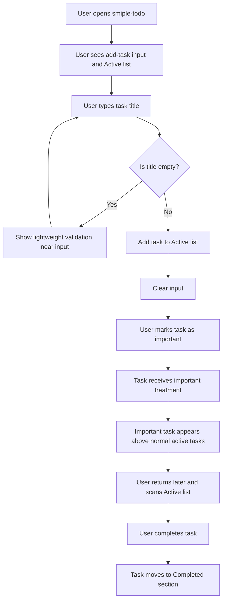
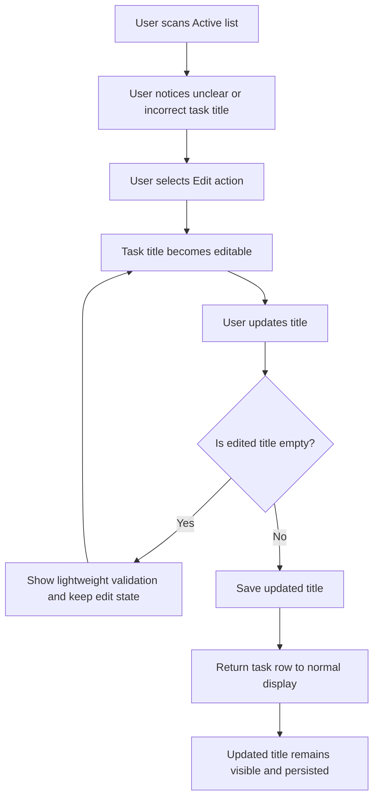
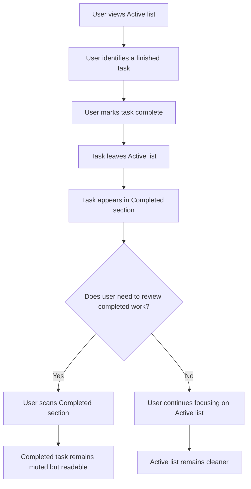

# UX Design Specification smiple-todo

**Author:** Cloly
**Date:** 2026-05-23

---

<!-- UX design content will be appended sequentially through collaborative workflow steps -->

## Executive Summary

### Project Vision

smiple-todo is a lightweight, local-first web todo application that helps students and employees capture tasks quickly, keep active work visible, and avoid missing important tasks. The experience should feel immediate, simple, and low-friction, with no account setup or onboarding required.

The MVP focuses on a clear task lifecycle: users add tasks, manage active tasks, mark important work, complete tasks, review completed tasks separately, and keep their list saved locally in the same browser.

### Target Users

The primary users are students and employees who manage study, work, and personal responsibility tasks. They need a simple tool that helps them capture tasks before they forget them, identify important tasks at a glance, and keep completed work out of the active task list.

These users may not want a full productivity system. The UX should assume they value speed, clarity, and low setup effort more than advanced organization features.

### Key Design Challenges

- Keep task management controls visible enough to be useful without making each task row feel cluttered.
- Make important tasks clearly noticeable while avoiding a visual treatment that overwhelms the list.
- Separate completed tasks from active work so users can review them without letting completed work distract from what remains.
- Support common desktop and mobile browser widths with a layout that remains readable and easy to operate.

### Design Opportunities

- Use a focused single-page layout that makes the main workflow obvious: add a task, scan active tasks, complete or update tasks, review completed tasks if needed.
- Use subtle visual hierarchy to place important active tasks at the top and make them stand out without introducing complex priority systems.
- Provide helpful empty states so first-time users understand the app immediately without onboarding.

## Core User Experience

### Defining Experience

The core experience of smiple-todo is fast task capture followed by clear task scanning. Users should be able to open the app, add a task with minimal effort, and immediately understand what still needs attention.

The most important repeated action is managing the active task list: adding new tasks, identifying important tasks, and marking tasks complete when finished. The experience should make the active list feel calm, current, and easy to act on.

### Platform Strategy

smiple-todo is a web-based application designed for modern desktop and mobile browsers. The MVP should work as a responsive single-page interface using local browser persistence.

The app should support both mouse/keyboard and touch interaction. Desktop users should be able to type and submit tasks quickly, while mobile users should be able to tap controls comfortably without dense or fragile layouts.

Offline-style local use matters because task data is stored in the browser and the MVP does not rely on accounts, cloud sync, or backend task storage.

### Effortless Interactions

Adding a task should feel immediate: type a title, submit, see the task appear in the active list, and return to a clean input state.

Scanning active tasks should require little effort. Important tasks should appear first and stand out visually, while normal active tasks remain readable and uncluttered.

Completing, editing, deleting, and marking a task as important should be discoverable without overwhelming each task row. Empty task titles should be prevented without creating a heavy error experience.

### Critical Success Moments

First-time success happens when a user can add their first task without instructions and immediately see it in the active list.

The most important value moment is when the user marks a task as important and sees it become easier to notice. This confirms that the app helps prevent important work from being buried.

Another success moment happens when completed tasks move out of the active list and into a separate Completed section, making the active list feel cleaner.

The experience fails if adding a task feels slow, important tasks are not visually obvious, or task controls make the list feel cluttered.

### Experience Principles

- Prioritize fast capture over complex organization.
- Keep active tasks visually clear and easy to scan.
- Make important tasks noticeable without making the whole list noisy.
- Separate completed work from active work to preserve focus.
- Keep every interaction understandable without onboarding.

## Desired Emotional Response

### Primary Emotional Goals

smiple-todo should make users feel calm, focused, and in control. The product should reduce the mental noise of remembering tasks by giving users a clear place to capture work and a simple way to see what still needs attention.

The strongest emotional goal is confidence: users should trust that important tasks will remain visible and that completed work will no longer distract them from active work.

### Emotional Journey Mapping

When users first open the app, they should feel that it is simple and approachable. The interface should immediately communicate what to do next without requiring explanation.

During task capture, users should feel fast and unblocked. Adding a task should create a small sense of relief because the task is now recorded and visible.

When marking a task as important, users should feel reassured that the task will not be buried. When completing a task, users should feel a small sense of accomplishment as the active list becomes cleaner.

When returning to the app later, users should feel continuity and trust because their saved tasks are still present in the same browser.

### Micro-Emotions

The most important micro-emotions are confidence, clarity, relief, and accomplishment.

The app should avoid confusion from unclear controls, anxiety from visually noisy lists, and frustration from losing task data or failing to save edits. It should also avoid making users feel like they need to learn a productivity system before getting value.

### Design Implications

- Calm and focused → use a simple layout, generous spacing, and limited visual emphasis.
- Confidence → keep important tasks visibly distinct and persist task changes immediately.
- Relief → make task creation quick, with the input cleared after successful add.
- Accomplishment → move completed tasks out of the active list and into a separate Completed section.
- Low frustration → prevent empty task titles with lightweight validation that does not interrupt the flow.

### Emotional Design Principles

- Reduce mental load instead of adding organization complexity.
- Make the next action obvious at every point.
- Use visual emphasis only where it helps users notice important work.
- Give users immediate feedback when tasks are added, edited, marked important, completed, or deleted.
- Preserve trust by making local persistence feel reliable and predictable.

## UX Pattern Analysis & Inspiration

### Inspiring Products Analysis

Todoist provides a strong reference for clear task hierarchy and fast task completion. Its most relevant pattern is the simple task row: a task title remains the primary focus, while supporting actions such as completion and priority stay secondary. For smiple-todo, this supports a calm active list where users can scan tasks quickly without feeling overwhelmed.

Google Keep is useful as inspiration for fast capture and lightweight interaction. Its note creation flow is direct and low-friction, and the interface feels approachable because it avoids heavy setup. For smiple-todo, this reinforces the need for an obvious task input, immediate task creation, and a clean post-add state.

Microsoft To Do is a useful reference for a friendly mainstream todo experience. It separates active work from completed work, keeps controls understandable, and uses simple visual language that works for non-expert productivity users. For smiple-todo, this supports a familiar single-page task management experience with a clear Completed section.

### Transferable UX Patterns

The most important transferable pattern is a focused task row where the task title is visually dominant and controls are secondary. This helps smiple-todo support completion, editing, deletion, and importance without making every task feel busy.

Another useful pattern is immediate capture feedback: after a user adds a task, the task appears in the active list and the input resets. This supports the emotional goals of relief, confidence, and speed.

A third pattern is progressive visibility for secondary sections. Completed tasks should remain available but visually less prominent than active tasks, similar to how mainstream todo apps keep completed work accessible without competing with current work.

### Anti-Patterns to Avoid

smiple-todo should avoid dense task rows with too many equally weighted icons or actions. If every control has the same visual importance, users may struggle to scan task titles and identify important work.

The app should avoid hidden core actions. Completing a task, marking it important, editing, and deleting should not require complicated menus or gestures in the MVP.

The app should avoid turning importance into a complex priority system. The PRD only requires important vs. not important, so multiple priority levels, labels, colors, or categories would add unnecessary complexity.

The app should also avoid visually loud highlighting for important tasks. Important tasks need to stand out, but the overall emotional goal is calm focus rather than urgency or alarm.

### Design Inspiration Strategy

Adopt the clear task-row hierarchy from Todoist: task title first, completion and other controls secondary.

Adopt the fast capture feel from Google Keep: obvious input, immediate creation, and no onboarding barrier.

Adapt the familiar completed-task separation from Microsoft To Do: completed work should be easy to find but less visually dominant than active work.

Avoid advanced productivity patterns such as filters, labels, projects, drag-and-drop, reminders, or multi-level priorities, because they conflict with the MVP goal of a lightweight todo app.

Use inspiration as a constraint toward simplicity: if a pattern adds setup, navigation, or conceptual overhead, it should not be included in the MVP UX.

## Design System Foundation

### 1.1 Design System Choice

smiple-todo will use a lightweight custom design system built with plain CSS design tokens and reusable UI patterns. The MVP does not require a large external design system or component library.

The design foundation should stay small and implementation-friendly for a vanilla HTML, CSS, and JavaScript web app.

### Rationale for Selection

A lightweight custom approach best matches the product scope and learning goal. smiple-todo needs a calm, simple, responsive interface rather than a broad component library.

Using plain CSS keeps the implementation easy to understand and maintain while still allowing consistent visual decisions across the app. This approach supports the MVP requirements without adding dependency overhead, framework setup, or unnecessary abstraction.

The app has a limited set of interface elements: a task input form, task rows or cards, active and completed sections, empty states, and task action controls. These can be designed consistently with a small set of custom tokens and patterns.

### Implementation Approach

The design system should define a compact set of reusable foundations:

- Color tokens for background, surface, text, muted text, border, primary action, important highlight, completed state, and error state.
- Typography rules for page title, section headings, task titles, helper text, and button labels.
- Spacing tokens for page padding, section gaps, task row padding, and control spacing.
- Component patterns for the add-task form, task row/card, action buttons, active list, completed section, empty state, and inline validation.
- Responsive rules for comfortable desktop and mobile layouts.

### Customization Strategy

The visual style should be calm, focused, and approachable. Important tasks should use a distinct but restrained treatment such as a subtle tinted background, accent border, or icon marker.

Completed tasks should appear visually secondary through muted text and lower emphasis, while still remaining readable in the Completed section.

Controls should be visually consistent and easy to recognize, but secondary actions should not compete with the task title. The design should avoid heavy decoration, dense icon clusters, or complex priority colors.

## 2. Core User Experience

### 2.1 Defining Experience

The defining experience of smiple-todo is: capture a task quickly, make important work visible, and clear completed work from the active list.

Users should be able to describe the product as a simple place where they can write down tasks, mark what matters, and keep their active list clean. The interaction does not need novelty; it needs to feel fast, obvious, and trustworthy.

If one interaction must be perfected, it is the active task loop: add a task, optionally mark it important, then complete it when done.

### 2.2 User Mental Model

Users already understand todo lists as a familiar pattern: write a task down, see it in a list, and check it off when finished. smiple-todo should build on this existing mental model rather than teaching a new system.

Users expect new tasks to appear immediately, completed tasks to move away from active work, and important tasks to remain easier to notice. They may become confused if important status behaves like a complex priority system or if completed tasks disappear entirely without a clear place to review them.

The UX should match the mental model of a lightweight checklist, not a project management tool.

### 2.3 Success Criteria

The core experience succeeds when:

- A first-time user can add a task without instructions.
- The task appears immediately in the active list.
- Important tasks are visually distinct and sorted above normal active tasks.
- Completing a task removes it from active work and places it in the Completed section.
- Users can edit, delete, or change importance without losing focus on the task title.
- The experience feels fast enough that users trust it for quick capture.

### 2.4 Novel UX Patterns

smiple-todo should rely on established UX patterns. The app does not need novel interaction design because the product value comes from simplicity and clarity.

The familiar patterns to adopt are:

- A top-level task input form for capture.
- A vertical active task list.
- Checkbox-style completion.
- Star or important marker for important tasks.
- Inline or lightweight edit behavior.
- A separate Completed section.

The unique design emphasis is not a new pattern, but the careful balance between visible controls and a calm, uncluttered list.

### 2.5 Experience Mechanics

**1. Initiation**

The user starts by focusing the task input at the top of the page. Placeholder or helper text should make it clear that the input is for adding a task.

**2. Interaction**

The user types a task title and submits it using the primary add action or keyboard submit. The app prevents empty titles. After successful creation, the task appears in the active list and the input clears.

For active tasks, the user can mark complete, mark or unmark important, edit the title, or delete the task.

**3. Feedback**

Successful task creation is shown by immediate appearance in the active list. Important status is shown by position and visual treatment. Completion is shown by the task moving to the Completed section. Edit success is shown by the updated title remaining visible.

Validation feedback for empty titles should be lightweight and close to the input.

**4. Completion**

The user feels done when the active list reflects only unfinished work. Completed tasks remain accessible in their own section without competing with active tasks.

## Visual Design Foundation

### Color System

smiple-todo should use a calm, light color system that supports focus and readability. The base interface should feel clean and quiet, with important tasks receiving restrained emphasis.

Recommended semantic color direction:

- Background: warm off-white or very light gray for a soft, low-noise page background.
- Surface: white for task cards, form areas, and list containers.
- Text: dark neutral for primary text, with softer gray for secondary helper text.
- Border: light neutral border for separating task rows without heavy visual weight.
- Primary action: calm blue or indigo for the Add action and focus states.
- Important highlight: soft amber or warm yellow tint with a subtle accent border.
- Completed state: muted gray text and lower-emphasis styling.
- Error state: accessible red for empty-title validation.

The important-task color should stand out enough to be noticed but should not feel like an alarm. Important status should communicate “pay attention” rather than “urgent danger.”

### Typography System

The typography should feel modern, friendly, and readable. A system sans-serif stack is recommended for the MVP to keep implementation simple and performance fast.

Recommended font stack:

```css
font-family: system-ui, -apple-system, BlinkMacSystemFont, "Segoe UI", sans-serif;
```

The type hierarchy should remain compact:

- Page title: clear and friendly, large enough to establish purpose.
- Section headings: medium-weight labels for Active and Completed.
- Task title: primary readable text in each task row.
- Helper text and empty states: smaller, muted text.
- Buttons/actions: concise labels with readable sizing.

The app does not need expressive display typography. Readability and clarity are more important than brand personality.

### Spacing & Layout Foundation

The layout should feel spacious enough to be calm, but not so airy that a task list becomes inefficient. An 8px spacing base is recommended.

Suggested spacing approach:

- Page padding: 16px on mobile, 24–32px on wider screens.
- Main content width: constrained center column, approximately 640–720px.
- Section spacing: generous separation between input, Active list, and Completed section.
- Task row padding: enough room for touch targets and readable text.
- Control spacing: grouped but not crowded.

The layout should use a simple single-column structure rather than a multi-column grid. This supports both desktop and mobile, keeps the mental model simple, and matches the core task-list experience.

### Accessibility Considerations

The visual foundation should support strong readability and keyboard-friendly interactions.

Accessibility requirements:

- Maintain sufficient contrast for text, buttons, borders, and validation messages.
- Ensure task controls have comfortable click/tap targets.
- Use visible focus states for input and buttons.
- Do not rely on color alone to communicate important or completed state; pair color with icon, label, position, or text treatment.
- Keep validation messages close to the relevant input.
- Ensure completed task styling remains readable even when muted.

## Design Direction Decision

### Design Directions Explored

Six design directions were explored for smiple-todo:

1. Calm Centered: balanced spacing, soft neutrals, straightforward task cards.
2. Productive Panel: contained app card, crisp borders, pragmatic productivity feel.
3. Friendly Focus: warmer and more encouraging with elevated cards.
4. Clean List: table-like list clarity for scanning many tasks efficiently.
5. Warm Minimal: approachable warmth with amber emphasis for important tasks.
6. Compact Utility: denser layout for users who prefer efficiency over spaciousness.

### Chosen Direction

The chosen direction is Direction 5: Warm Minimal.

This direction uses a warm, approachable visual tone while preserving a simple single-column task experience. Important tasks receive amber emphasis, and the overall interface remains minimal, calm, and easy to scan.

### Design Rationale

Warm Minimal best supports the emotional goals of calm, focus, relief, and confidence. It avoids a cold productivity-tool feeling while still keeping the app lightweight and practical.

The warm amber treatment aligns naturally with the important-task concept because it communicates “pay attention” without feeling like an urgent error. Rounded controls and soft spacing make the interface approachable for students and employees who want a simple task list rather than a heavy productivity system.

### Implementation Approach

The implementation should use the Warm Minimal direction as the visual baseline:

- Warm off-white page background.
- White or lightly warm surfaces for task containers.
- Amber highlight treatment for important tasks.
- Rounded input and primary Add button.
- Soft task card styling with clear title hierarchy.
- Muted completed-task treatment.
- Minimal visual decoration and no dense icon clusters.

The design should remain simple enough to implement with plain HTML, CSS, and JavaScript.

## User Journey Flows

### Capture and Remember an Important Task

This journey covers the primary value loop: the user captures a task, marks it important, sees it move above normal active tasks, and later completes it.



Key UX requirements:

- The add-task input must be visible immediately.
- Empty-title validation should not interrupt the flow.
- Important status should create both visual emphasis and list position change.
- Completion should visibly clean up the Active list.

### Correct a Task After Creating It

This journey covers editing a task title after the user notices a typo or wants to clarify the wording.



Key UX requirements:

- Edit should be discoverable but secondary to task scanning.
- Empty edited titles should be prevented.
- Save/cancel behavior should be clear.
- The task should remain in context during editing rather than moving the user elsewhere.

### Complete and Review a Task

This journey covers finishing work and confirming that completed tasks remain available without distracting from active tasks.



Key UX requirements:

- Completing a task should produce immediate feedback.
- Completed tasks should not disappear entirely.
- Completed section should be visually secondary.
- Active list should remain the main focus of the page.

### Journey Patterns

Common patterns across journeys:

- Single-page continuity: users stay on the same page for task creation, editing, completion, and review.
- Immediate feedback: every action updates the visible list right away.
- Lightweight validation: invalid empty titles are handled near the relevant input.
- Visual hierarchy: active work is primary, important active work is emphasized, completed work is secondary.
- Local persistence: successful changes should feel saved immediately.

### Flow Optimization Principles

- Minimize steps between intent and visible result.
- Keep the task title as the dominant element in each task row.
- Make secondary controls available without making the list feel crowded.
- Avoid modal-heavy flows for MVP interactions.
- Use movement between Active and Completed as feedback for completion.

## Component Strategy

### Design System Components

smiple-todo uses a lightweight custom design system rather than an external component library. The available foundation is a small set of CSS tokens and reusable UI patterns:

- Color tokens for background, surface, text, muted text, border, primary action, important highlight, completed state, and error state.
- Typography styles for page title, section headings, task titles, helper text, and action labels.
- Spacing tokens based on an 8px scale.
- Shared button, input, card, list, empty state, and validation styles.

Because there is no external component library, all product-specific components should be implemented as simple semantic HTML structures styled with the shared CSS foundation.

### Custom Components

#### App Shell

**Purpose:** Provides the centered single-page layout for the app.  
**Usage:** Wraps the full smiple-todo interface.  
**Anatomy:** Page background, centered content container, title area, add-task area, Active section, Completed section.  
**States:** Default responsive desktop and mobile layouts.  
**Accessibility:** Main content should use semantic landmark structure where appropriate.  
**Content Guidelines:** Keep page copy short and functional.  
**Interaction Behavior:** No direct interaction; supports layout consistency.

#### Add Task Form

**Purpose:** Lets users create a task quickly.  
**Usage:** Always visible near the top of the page.  
**Anatomy:** Text input, primary Add button, optional validation message.  
**States:** Default, focused, invalid, submitting/success feedback if needed.  
**Accessibility:** Input should have an accessible label; Add button should be keyboard reachable; validation should be programmatically associated with the input.  
**Content Guidelines:** Placeholder/helper text should make task capture obvious.  
**Interaction Behavior:** Submit creates a task when title is non-empty, clears the input, and updates the Active list immediately.

#### Task Item

**Purpose:** Displays one task and its available actions.  
**Usage:** Used in Active and Completed sections.  
**Anatomy:** Completion control, task title, important control, edit action, delete action, optional important marker.  
**States:** Default active, important active, editing, completed, empty-title edit error, hover/focus.  
**Accessibility:** Actions need clear labels; completion and important controls should expose state; keyboard users should be able to reach all actions.  
**Content Guidelines:** Task title should remain the dominant content.  
**Interaction Behavior:** Supports mark complete, mark/unmark important, edit title, and delete.

#### Active Task List

**Purpose:** Shows unfinished tasks, with important tasks sorted first.  
**Usage:** Primary content section.  
**Anatomy:** Section heading, task count if useful, task items, empty state.  
**States:** Has tasks, empty, mixed important/normal tasks.  
**Accessibility:** Heading should clearly identify the section.  
**Content Guidelines:** Empty state should be helpful and short.  
**Interaction Behavior:** Updates immediately when tasks are added, completed, deleted, edited, or marked important.

#### Completed Section

**Purpose:** Shows completed tasks separately from active work.  
**Usage:** Secondary section below Active.  
**Anatomy:** Section heading, completed task items, empty state.  
**States:** Has completed tasks, empty.  
**Accessibility:** Heading should clearly identify completed work.  
**Content Guidelines:** Completed task styling should be muted but readable.  
**Interaction Behavior:** Receives tasks when completed; supports deletion if included for completed tasks.

#### Empty State

**Purpose:** Helps users understand what to do when a section has no tasks.  
**Usage:** Appears in Active and Completed sections when empty.  
**Anatomy:** Short text message, optional subtle visual treatment.  
**States:** Active empty, Completed empty.  
**Accessibility:** Plain readable text is sufficient.  
**Content Guidelines:** Use direct language such as “No active tasks yet. Add a task above.”  
**Interaction Behavior:** No interaction required.

#### Inline Validation Message

**Purpose:** Explains why an empty task title cannot be saved.  
**Usage:** Appears near the add input or edit input.  
**Anatomy:** Short error text, error color, input association.  
**States:** Hidden, visible.  
**Accessibility:** Should be associated with the relevant input and not rely on color alone.  
**Content Guidelines:** Keep message short, e.g. “Task title can’t be empty.”  
**Interaction Behavior:** Appears after invalid submit/save and clears when valid input is provided.

### Component Implementation Strategy

Components should be implemented with simple semantic HTML, CSS classes, and JavaScript state rendering. Shared CSS tokens should define consistent spacing, color, typography, border radius, and focus states.

Task Item is the most important custom component because it carries the core interaction load. It should be designed carefully so task scanning remains primary while actions remain accessible.

The MVP should avoid over-componentizing. Components should exist where they improve clarity and reuse, not as framework-style abstractions.

### Implementation Roadmap

**Phase 1 - Core Components**

- App Shell — needed to establish the single-page layout.
- Add Task Form — needed for first-time task capture.
- Active Task List — needed for the main task experience.
- Task Item — needed for display, completion, importance, edit, and delete.

**Phase 2 - Supporting Components**

- Completed Section — needed to separate completed work from active work.
- Empty State — needed for first-time and no-task states.
- Inline Validation Message — needed for empty title prevention.

**Phase 3 - Refinement Components**

- Important marker treatment — refine visual distinction after the base task item is implemented.
- Responsive control layout — refine mobile usability after core desktop/mobile structure exists.
- Focus and keyboard states — refine accessibility polish across all interactive elements.

## UX Consistency Patterns

### Button Hierarchy

smiple-todo should use a simple action hierarchy:

**Primary action:** Add task.  
The Add button is the only primary button in the main task capture flow. It should use the primary color and strong visual weight.

**Secondary actions:** Edit, Save, Cancel, Delete, mark important, and mark complete.  
Secondary actions should be visible and accessible but should not visually compete with the task title or Add button.

**Destructive action:** Delete.  
Delete should use a lower-emphasis default treatment and a clearer destructive style only when activated or confirmed if confirmation is used. For MVP, delete can be immediate if the control is clear and not easy to trigger accidentally.

**Completion action:** Complete task.  
Completion should be represented with a checkbox-style control or equivalent familiar pattern.

**Important action:** Mark important.  
Important should use a star or clear label/icon pattern. Its selected state should be visually distinct and accessible.

### Feedback Patterns

All task actions should produce immediate visible feedback:

- Add task: new task appears in Active list and input clears.
- Mark important: task receives important styling and sorts above normal active tasks.
- Unmark important: task returns to normal active styling and sorting.
- Complete task: task moves from Active to Completed.
- Edit task: updated title appears in place and persists.
- Delete task: task is removed from the visible list.
- Invalid empty title: inline validation appears near the relevant input.

Feedback should be calm and direct. The MVP does not require toast notifications or complex animation. Subtle transitions may be used if they do not delay the interaction.

### Form Patterns

The add-task form should be visible near the top of the page and remain the main entry point for task capture.

Form behavior:

- The task title input should have a clear label or accessible name.
- Placeholder/helper text should indicate that users can add a task.
- Submitting an empty or whitespace-only title should show inline validation.
- Successful submit should clear the input.
- Keyboard submit should be supported.
- Validation should stay close to the input and use concise language.

Editing a task title should follow the same validation rules as adding a task. Users should not be able to save an empty title.

### Navigation Patterns

smiple-todo is a single-page app and should not require navigation between screens for MVP task management.

The page structure should be:

1. App title and short helper text.
2. Add-task form.
3. Active task section.
4. Completed task section.

Users should remain in context while adding, editing, completing, or deleting tasks. Modal navigation should be avoided for MVP flows.

### Additional Patterns

#### Empty States

Empty states should be short, helpful, and calm.

Recommended examples:

- Active empty: “No active tasks yet. Add a task above.”
- Completed empty: “No completed tasks yet.”

Empty states should not feel like errors.

#### Completed Task Styling

Completed tasks should be visually secondary but still readable. Muted text, lower contrast, and optional line-through may be used, but the text should remain accessible.

#### Important Task Styling

Important tasks should be visually distinct through a restrained amber treatment, an icon/label, and placement above normal active tasks. Color should not be the only indicator.

#### Error Recovery

Validation errors should not reset the user’s input. Users should be able to correct the title and submit again without losing context.

#### Mobile Interaction

Controls should remain large enough to tap comfortably. If horizontal space is limited, secondary actions may wrap or use concise labels/icons, but core actions must remain discoverable.

## Responsive Design & Accessibility

### Responsive Strategy

smiple-todo should use a responsive single-column layout across mobile, tablet, and desktop. The product does not need multi-column navigation or complex responsive behavior because the core experience is a simple task list.

**Desktop strategy:**  
Use extra screen space by centering the app in a readable content column, approximately 640–720px wide. Keep the task list focused rather than stretching rows across the full viewport.

**Tablet strategy:**  
Use the same single-column structure with comfortable spacing and touch-friendly controls. Avoid introducing tablet-specific navigation because the MVP has no multi-screen structure.

**Mobile strategy:**  
Prioritize the add-task form, Active list, and readable task rows. Controls should remain tappable and may wrap or use concise labels/icons on narrow screens. The Completed section should remain below Active so unfinished work stays primary.

### Breakpoint Strategy

Use a mobile-first breakpoint strategy with simple standard breakpoints:

- Mobile: 320px–767px
- Tablet: 768px–1023px
- Desktop: 1024px+

The base CSS should target mobile first. Wider breakpoints should increase page padding, constrain content width, and improve spacing rather than changing the information architecture.

No separate mobile navigation is needed for the MVP.

### Accessibility Strategy

smiple-todo should target WCAG 2.1 AA as the practical accessibility baseline.

Key accessibility requirements:

- Normal text should meet at least 4.5:1 contrast.
- Large text and non-text UI indicators should meet appropriate contrast requirements.
- All controls should be reachable and usable by keyboard.
- Focus states should be visible for inputs, buttons, and task action controls.
- Touch targets should be comfortable, ideally at least 44x44px where practical.
- Important state should not rely on color alone; pair amber styling with label, icon, or position.
- Completed state should not rely only on color or line-through; section placement and accessible labels should clarify status.
- Inputs and validation messages should be programmatically associated.
- Buttons and icon controls should have clear accessible names.

### Testing Strategy

Responsive testing should cover:

- Narrow mobile width around 320px.
- Common mobile width around 375–430px.
- Tablet width around 768px.
- Desktop width 1024px and above.
- Chrome and at least one additional modern browser.

Accessibility testing should cover:

- Keyboard-only task creation, edit, complete, important toggle, and delete.
- Visible focus order from top to bottom.
- Screen reader labels for add, complete, important, edit, delete, and validation messages.
- Contrast checks for text, important highlight, muted completed text, and error state.
- Touch target usability on mobile widths.

### Implementation Guidelines

Use semantic HTML wherever possible:

- Use `main` for the app content.
- Use `form` for task creation.
- Use proper `button` elements for actions.
- Use headings for Active and Completed sections.
- Use lists or list-like semantic structure for task collections where practical.

Use mobile-first CSS:

- Start with a narrow single-column layout.
- Use relative units such as `rem` for typography and spacing where practical.
- Add media queries only to improve spacing and width constraints.
- Avoid fixed widths that cause horizontal scrolling.

Use accessible interaction patterns:

- Preserve keyboard focus during editing.
- Ensure validation messages are announced or associated with the relevant input.
- Give icon-only controls accessible labels.
- Keep state changes visually clear and reflected in accessible names or text where needed.
